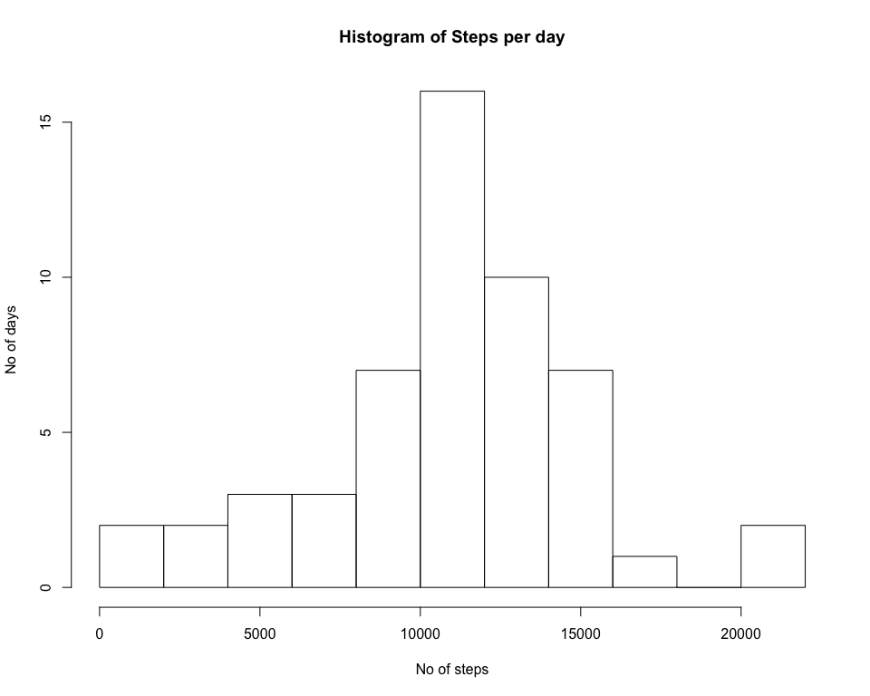
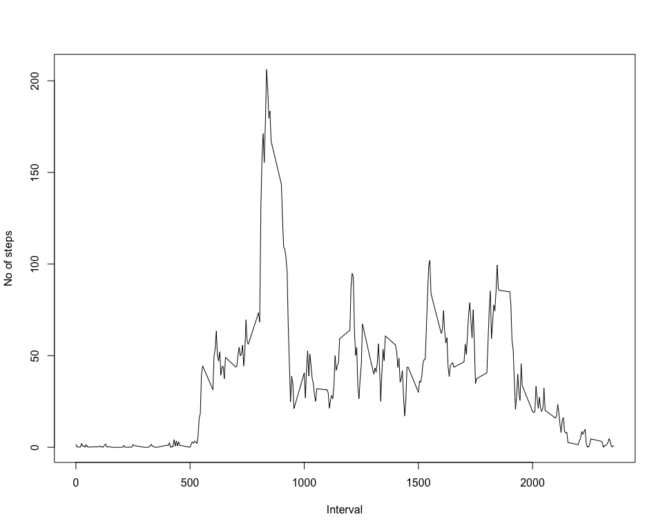
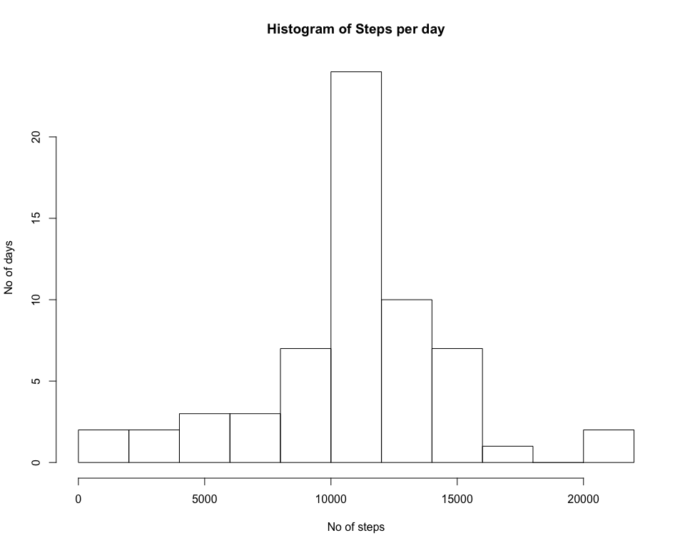
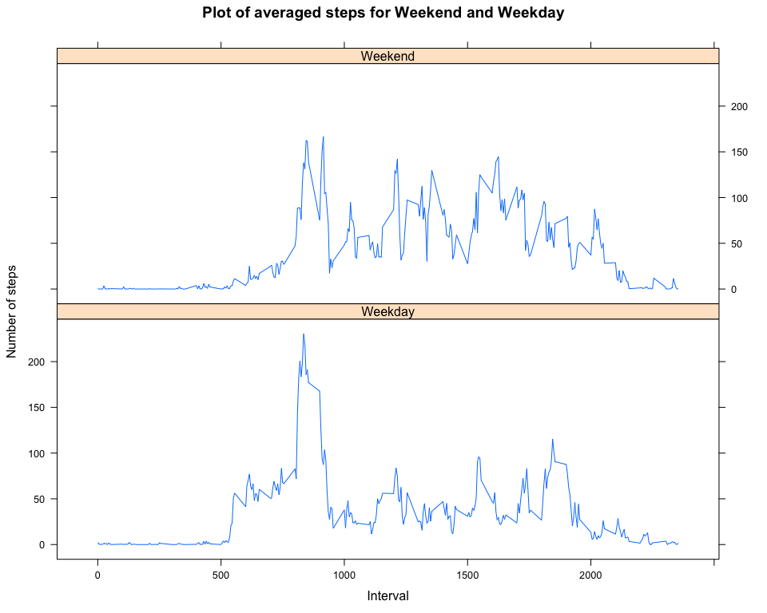

# Assignment-Activity Monitoring


## R Markdown

This is a R Markdown document for the assignment titled Activity Monitoring. The Markdown document code will perform the required analysis and output as an html file.

### Code to read in data
This portion of the code reads in data and remove NA values to give the total number of steps and perform simple statistical analysis such as the mean and median steps in a day. 


```r
rawdata<-read.csv("activity.csv",sep=",")
rawdata_NA<-na.omit(rawdata)
rawdatato<-rawdata
```

### Code to summarize the data, taking mean, median and sum of steps taken
This portion of the code summarizes the data. The total steps per day is computed and an histogram is calculated.

```r
date_sum<-ddply(rawdata_NA,~date,summarise,sum=sum(steps))
mediandata<-median(date_sum$sum)
meandata<-mean(date_sum$sum)
interval_mean<-ddply(rawdata_NA,~interval,summarise,mean=mean(steps))
```
**The mean for the total number of steps taken in a day is 1.0766189\times 10^{4} and the median steps is 10765**


### Plot of total steps taken in a day


```r
hist(date_sum$sum,xlab="No of steps",ylab="No of days",breaks=10,main="Histogram of Steps per day")
```

<!-- -->

### Plot of steps for time interval averaged over all the dates
<!-- -->

### This portion of code calculates the time interval for which the number of steps is maximum 

This portion finds the time interval for which the average number of steps is maximum


```r
ini<-which.max(interval_mean$mean)
timemax<-interval_mean$interval[ini]
```

**The time interval for which the maximum of steps taken is 835.**

### This portion of the code cacluates the number of NA values

 
 ```r
 ori<-dim(rawdata)
 mis<-dim(rawdata_NA)
 totalrow<-ori[1]-mis[1]
 ```

**The total number of rows with NA is 2304. **

### This portion of code substitue the NA values with mean values

```r
indica<-data.frame(which(is.na(rawdatato)))
tmpsto<-matrix(nrow=nrow(indica),ncol=2)
for (i in 1:nrow(indica))
{
tmpout<-rawdatato[indica[i,1],3]
for (j in 1:nrow(interval_mean))
if(interval_mean[j,1]==tmpout)
{

rawdatato[indica[i,1],1]=interval_mean[j,2]
tmpsto[i,1]<-tmpout
tmpsto[i,2]<-interval_mean[j,1]
}
}
```

### This portion calculates the historgram, mean and median for the filled dataset.

```r
date_sum2<-ddply(rawdatato,~date,summarise,sum=sum(steps))
mediandata2<-median(date_sum2$sum)
meandata2<-mean(date_sum2$sum)
interval_mean2<-ddply(rawdatato,~interval,summarise,mean=mean(steps))
```

**The mean of rawdata with remove NA is 1.0766189\times 10^{4} vs 1.0766189\times 10^{4} from filled data. **
**The median of rawdata with remove NA is 10765 vs `1.0766189\times 10^{4} from filled data. **

The impact of filling in data points is minimal to the mean and median for the total steps taken

###  Histogram plot of total steps taken in a day with filled data

```r
hist(date_sum2$sum,xlab="No of steps",ylab="No of days",breaks=10,main="Histogram of Steps per day")
```

<!-- -->

### This portion of the code adds the two factors of weekday and weekend to the data

```r
rawdatato$day<-weekdays(as.Date(rawdatato$date))
rawdatato$wek<-weekdays(as.Date(rawdatato$date))
for (i in 1:nrow(rawdatato)){
if(rawdatato$day[i]=="Sunday" || rawdatato$day[i]=="Saturday")
{
rawdatato$wek[i]<-"Weekend"  
}
else
  {
    rawdatato$wek[i]<-"Weekday"
  }
}

rawdatamean<-ddply(rawdatato,.(interval,wek),summarise,step=mean(steps))
```
### This plot compares the average number of steps for Weekend and Weekday

```r
library(lattice)
xyplot(step~interval|factor(wek),data=rawdatamean,layout=c(1,2),type="l",xlab="Interval",ylab="Number of steps",main="Plot of averaged steps for Weekend and Weekday")
```

<!-- -->

**From the plots, it can be seen that there are more physical activities throughout the day.**
